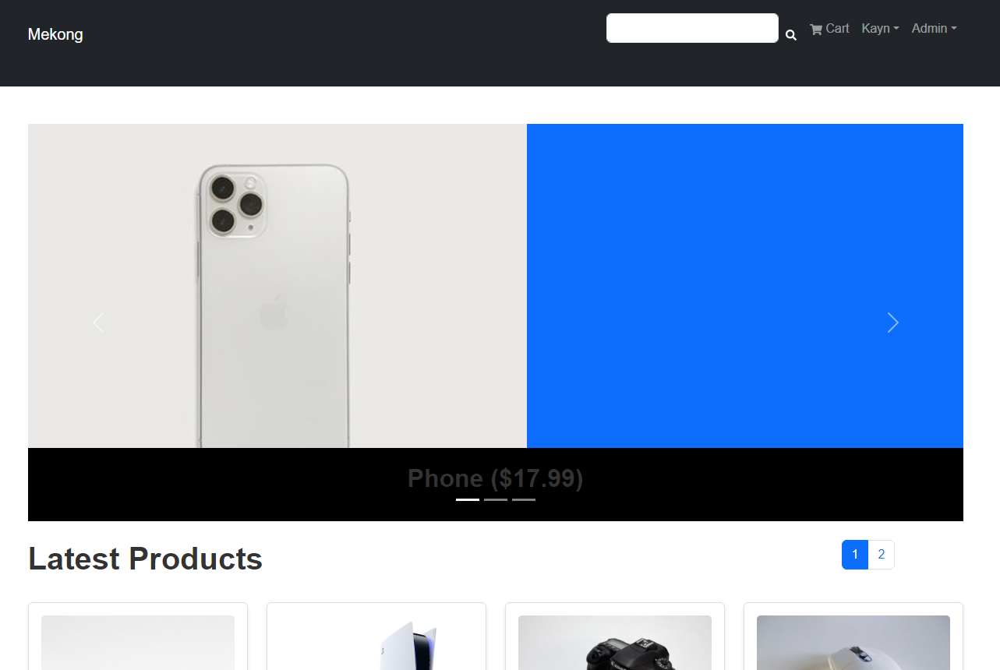
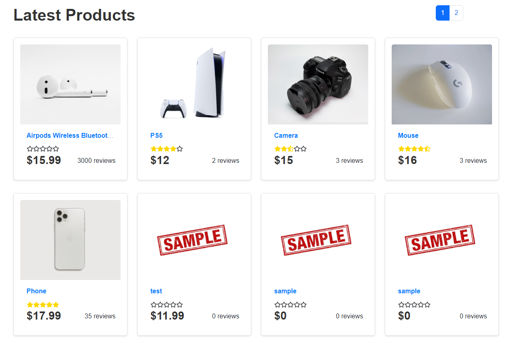

# Mekong App

E-commerce webapp project built with the MERN stack
- MongoDB
- Express JS
- React + Redux Tlk
- Node JS
- Plues other relevant packages

## Features

- **User Authentication:** Secure user registration and login system.
- **Product Browsing:** Easy navigation through various product categories.
- **Search Functionality:** Powerful search to find products quickly.
- **Shopping Cart:** Add, remove, and manage items in the shopping cart.
- **Checkout Process:** Seamless checkout with Paypal.
- **Order Management:** Track and manage orders.
- **Admin Dashboard:** Manage products, categories, users, and orders from an admin interface.
- **Responsive Design:** Optimized for both desktop and mobile devices.

## License

This project is licensed under the MIT License. See the [LICENSE](LICENSE) file for details.
